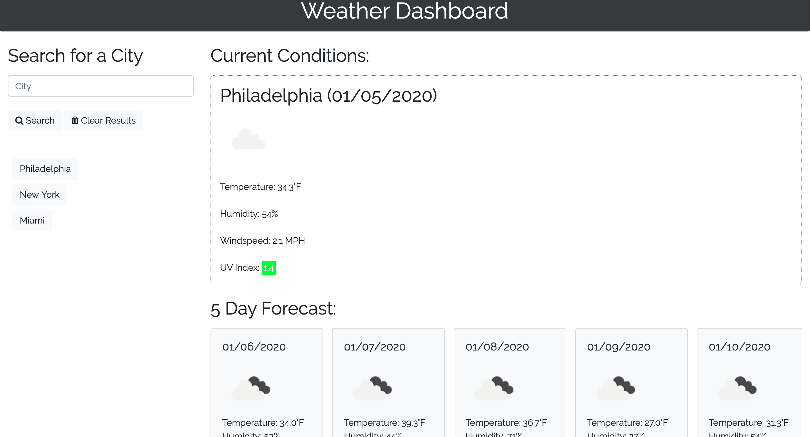

# Weather Dashboard
Created during Week 6 of UPenn Coding Bootcamp.

## Overview
In this assignment, the challenge was to build a weather dashboard application with search functionality to find current weather conditions and the future weather outlook for multiple cities. This app runs in the browser and features dynamically updated HTML and CSS powered by jQuery.

## Utilizing the App
- View the app: [Here](https://acucunato.github.io/weather-dashboard/ "Here")
- User can input a city then hit "Search".
- When user hits "Search", current weather conditions for the searched city will append to the page along with a 5 day forecast for that city.
- A button will be created with users search history so that users can access their past search terms. Clicking on the city name will perform a new search that returns current and future conditions for that city.
- User can click "Clear Results" to clear the searched city's results.

## Demo

## Tech used
- HTML
- CSS
- Bootstrap
- Javascript
- jQuery
- Moment.js API
- OpenWeather API

## Contributers
- Alyssa Cucunato